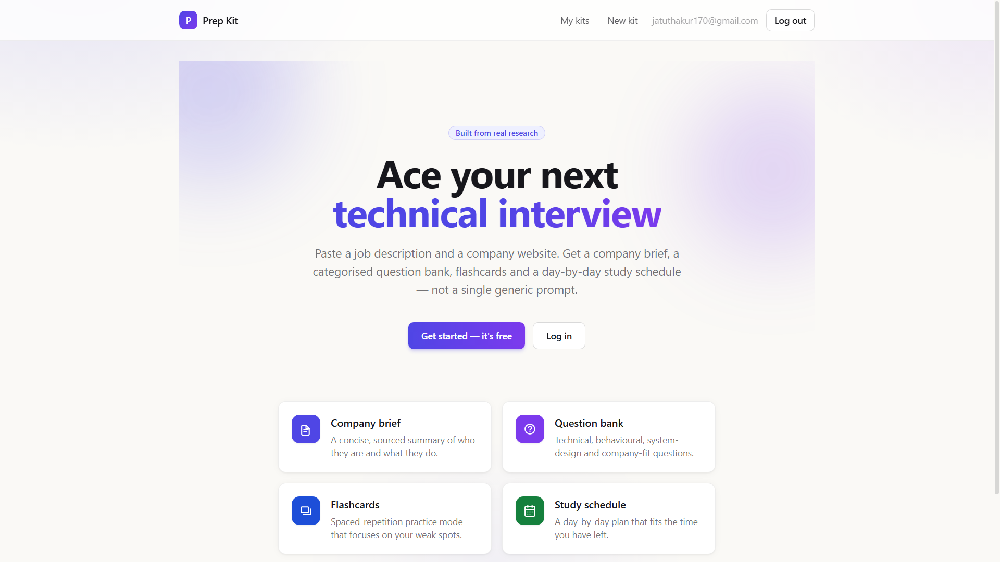
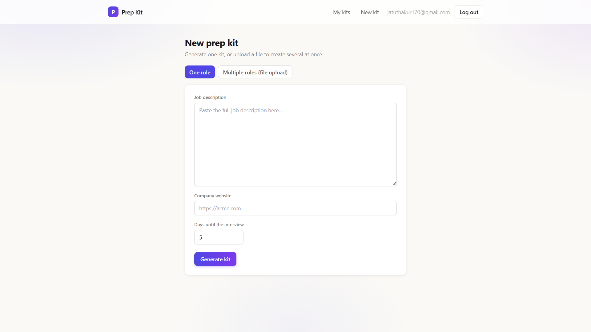
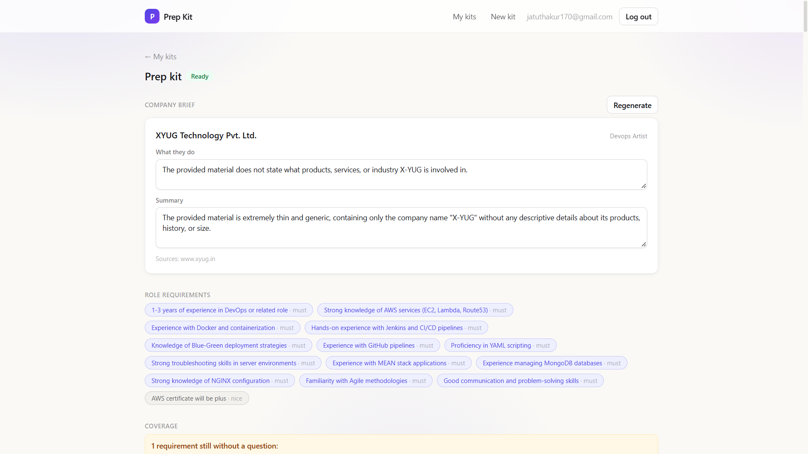

# AI Interview Prep Kit

Turns a job description + company URL into a personalised interview prep kit:
company brief, role breakdown, categorised question bank, flashcards, and a
day-by-day study schedule — reshapeable, and practiseable, inside the app.

**Status:** feature-complete. Backend (pipeline, auth, database, HTTP API,
mandatory batch CLI) and frontend (Next.js builder + practice UI) are both
implemented, wired together, and manually verified end to end (generation,
regeneration with edit-preservation, practice mode, and the batch CLI).

## Screenshots

**Landing page**


**New kit form**


**Generated kit — company brief and requirements**


## Tech stack

| Layer      | Choice                          |
|------------|----------------------------------|
| Backend    | Node.js + Express (TypeScript)  |
| Database   | MongoDB (official `mongodb` driver, no ORM) |
| Auth       | bcrypt password hashing + JWT session cookie |
| LLM        | Google Gemini, genuine free tier (see "LLM provider and model" below) |
| Discussion search | Brave Search API (2,000 free queries/month) — optional; the app works honestly without it |
| Frontend   | Next.js 14 (App Router) + Tailwind CSS |

Gemini and Brave were picked because both have a real free tier with no card
required, and both are swappable behind small interfaces (`LLMClient`,
`DiscussionSearchClient`) — a different provider is a new adapter file, not a
rewrite of any pipeline code.

## LLM provider and model

Google Gemini, via the plain `generateContent` REST endpoint (no SDK
dependency). The model is read from `GEMINI_MODEL` and **defaults to
`gemini-flash-latest`** — Google's rolling alias to whatever its current
stable Flash model is, rather than a version pinned by name.

This was a deliberate choice, not an oversight: an earlier pinned model
(`gemini-2.5-flash`) was retired by Google mid-development, which turned into
a real, reproducible failure (`Gemini HTTP 404`) during testing. Pinning a
model name trades reproducibility for a shelf life the developer doesn't
control; the `-latest` alias trades a small amount of reproducibility for the
app not silently breaking the day Google retires a model. Anyone who wants a
pinned, reproducible model for grading can set `GEMINI_MODEL=gemini-3.6-flash`
(or any current model name) in `.env` — no code change needed.

In practice, `gemini-flash-latest` is a very high-traffic shared alias and
occasionally returns `503` ("model overloaded") under load. `withRetry()`
already retries these with exponential backoff (see Security/Robustness
below); if `503`s are still frequent in your environment,
`GEMINI_MODEL=gemini-flash-lite-latest` is a lighter, less contended
alternative that works well for this pipeline's extraction/generation calls.

## Setup (local)

```bash
cd backend
npm install
cp .env.example .env
# fill in GEMINI_API_KEY at minimum; MONGODB_URI defaults to a local instance
npm run dev        # starts the API on :4000 (or $PORT)
npm test           # runs the unit test suite (84 tests)
```

You need a MongoDB instance reachable at `MONGODB_URI` (a free MongoDB Atlas
cluster works, or `docker run -p 27017:27017 mongo` locally).

In a second terminal, start the frontend:

```bash
cd frontend
npm install
cp .env.example .env.local
# NEXT_PUBLIC_API_URL defaults to http://localhost:4000, matching the backend above
npm run dev         # UI on :3000
```

Open `http://localhost:3000`, sign up, and create a kit. The backend's
`CORS_ORIGINS` (in `backend/.env`) must include the frontend's origin —
`http://localhost:3000` is the default on both sides, so local dev works
with no extra configuration.

### Environment variables

| Variable | Where | Required? | Purpose |
|---|---|---|---|
| `GEMINI_API_KEY` | backend | **Required** | Auth key for the Gemini API. Get a free one at [aistudio.google.com/apikey](https://aistudio.google.com/apikey). |
| `GEMINI_MODEL` | backend | Optional (default `gemini-flash-latest`) | Which Gemini model to call. See "LLM provider and model" above. |
| `BRAVE_API_KEY` | backend | Optional | Enables the public-interview-discussion search. Without it, that step is skipped and reported honestly (`found: false`) rather than erroring. |
| `MONGODB_URI` | backend | **Required** | Connection string for the kits/users database. |
| `JWT_SECRET` | backend | **Required** | Signs the session cookie. Use a long random string in production. |
| `CORS_ORIGINS` | backend | **Required** | Comma-separated list of origins allowed to call the API (must include the deployed frontend's URL in production). |
| `PORT` | backend | Optional (default `4000`) | Port the Express server listens on. |
| `ALLOW_LOCAL_FETCH` | backend | Optional | Lets the crawler follow `http://localhost` URLs. Only set by the batch CLI internally — never needed/should be set for the public HTTP API (SSRF protection). |
| `NEXT_PUBLIC_API_URL` | frontend | Optional (default `http://localhost:4000`) | Base URL the frontend calls for the API. Must point at the deployed backend URL in production. |

## Deployment

- **Frontend:** Vercel (free tier). Import the repo, set the root directory
  to `frontend`, and set `NEXT_PUBLIC_API_URL` to the deployed backend's URL.
- **Backend:** Render or Railway (free tier). Root directory `backend`,
  build command `npm install`, start command `npm start`. Set all the
  backend env vars above, with `CORS_ORIGINS` pointing back at the deployed
  Vercel URL.
- **Database:** MongoDB Atlas free (M0) cluster; `MONGODB_URI` from Atlas's
  connect dialog.

Live URLs:
- Frontend: [frontend-gamma-wheat-83.vercel.app](https://frontend-gamma-wheat-83.vercel.app/)
- Backend: [ai-interview-prep-kit-q1qr.onrender.com](https://ai-interview-prep-kit-q1qr.onrender.com)

> **Note:** The backend is hosted on Render's free tier, which spins down
> after 15 minutes of inactivity. The first request after idling can take
> 20–30 seconds to wake up — this is expected, not a bug.

## Frontend architecture

Plain `fetch` wrapper (`frontend/src/lib/api.ts`) calling the Express API
with `credentials: "include"`, so the httpOnly session cookie set by
`/api/auth/login` is sent automatically — no client-side token handling.
`useAuth` loads the session once via `GET /api/auth/me` and every protected
page calls `useRequireAuth`, which redirects a signed-out visitor to
`/login` (brief Section 1: "a signed-out visitor cannot reach protected
pages").

The kit page polls `GET /api/kits/:id` every 2.5s while status is
`pending`/`generating`, so the person watches real progress instead of a
static spinner, then stops polling once the kit is `ready` or `failed`.
Every inline edit (question prompt, answer outline, flashcard, company
brief) saves on blur through its own small `PATCH` call and merges the
returned kit back into local state — no keystroke-by-keystroke
round-tripping. A small coloured dot (`OriginDot`) shows whether each
question/flashcard is AI-generated, edited, or added by hand, mirroring the
backend's `origin` field; question cards also carry a category-coloured
left border and a colour-coded difficulty badge so the question bank is
scannable at a glance.

Reordering uses ↑/↓ buttons scoped to a question's own category rather than
drag-and-drop — a deliberate trade-off: it's fully keyboard- and
screen-reader-operable with no extra dependency, at the cost of feeling
less fluid than drag-and-drop for large lists.

Styling is Tailwind CSS with a small hand-written design-token layer
(`globals.css`: `.card`, `.btn-primary`, `.input`, status/priority colour
scales, etc.) rather than a component library, so loading/empty/error states
and the builder's editable surfaces stay visually consistent across pages.

## Batch entry point (mandatory, brief Section 9)

Runs the exact same pipeline as the HTTP API, no parallel implementation:

```bash
npm run evaluate -- --input cases.json --output kits.json
```

`cases.json` is an array of `{ id, jd, company_url, days }`. `kits.json` is
written in the exact shape from Appendix B: `{ version, generated_at, kits: [{
id, status, kit, error }] }`. One case failing doesn't abort the run.

The CLI's argument parser also accepts plain positional args
(`npm run evaluate -- cases.json kits.json`) as a fallback, since some
npm-on-Windows-PowerShell setups were observed stripping the `--input`/
`--output` flag names while still forwarding their values positionally —
both forms are supported so the documented command works regardless of shell.

Company sites used with this command may be served from `http://localhost`;
the crawler is told to allow loopback fetches only for this command (never
for the public HTTP API, where loopback URLs are rejected as an SSRF
protection).

## High-level architecture

```
src/
  domain/      Appendix A kit schema (zod) + cross-reference validation
  fetch/       SSRF-safe fetch, robots.txt, HTML→text, company-site crawler
  discussion/  public interview-discussion search (Brave Search adapter)
  llm/         provider-agnostic LLM client, Gemini adapter, retry/backoff, loose JSON parsing
  pipeline/    the actual generation logic (see below) — this is what both
               the HTTP API and the batch CLI call
  db/          MongoDB connection + typed collections (users, kits)
  auth/        password hashing, JWT session cookies, requireAuth middleware
  api/         Express routes (auth, kits) + the background generation runner
  cli/         the mandatory `npm run evaluate` entry point
  app.ts, server.ts   Express app wiring / process entry point
```

Retrieval, extraction, generation, scheduling and persistence are kept as
separate modules on purpose (backend requirement): the API layer never talks
to Gemini directly, and the pipeline never talks to MongoDB — `generateKit()`
is a pure function of (job description, company URL, days, an `LLMClient`, a
`DiscussionSearchClient`) → a validated `Kit`.

## Retrieval approach and sources used

- **Job description**: pasted as text, never fetched — most boards block
  automated access, and the brief asks for effort to go into the interesting
  half instead.
- **Company site**: `crawlCompanySite()` fetches the homepage, extracts every
  same-origin link, and *ranks* them by how strongly the URL/anchor text
  suggests "this is about hiring" (`/careers`, `/jobs`, "how we hire", "life
  at", etc. — a scoring function, not a fixed path list, because the brief's
  own test found the real page at unpredictable paths). The top-scoring pages
  are fetched, re-scored using their actual content, and the best becomes the
  hiring/interview-process page. `robots.txt` is respected before any page
  (including the homepage) is fetched.
- **Public interview discussion**: one Brave Search query per company
  (`"<company> interview process questions experience"`), results ranked by
  a relevance heuristic (mentions the company + "interview", or comes from a
  known discussion host like Glassdoor/Blind/Reddit). Absence is reported
  honestly, not treated as an error (Section 10).

## Sequencing (brief Section 3)

`generateKit()` runs, in order:

1. **Extract requirements** from the pasted JD (LLM call, one attempt +
   one JSON-repair retry). Every kept requirement's `evidence` must appear
   verbatim in the JD — anything the model proposes that isn't actually
   there is dropped, never invented. Must/nice is settled by the JD's own
   wording (`jdStructure.ts`) where that's unambiguous, overruling the
   model's guess.
2. **Crawl the company site** (only useful *after* step 1 tells us anything
   about who's hiring — the homepage needs no context from the JD, but the
   choice of what to do with the hiring page does).
3. **Search for public interview discussion**, keyed off the company name
   extracted/derived in step 1.
4. **Generate questions**, one LLM call *per requirement*, with a
   category-specific system prompt chosen by the requirement's `kind`
   (technical → hands-on technical prompts; behavioural → STAR-style
   prompts) — Section 3 is explicit that these must not come from the same
   call with the same instructions. A separate call generates
   process/system-design questions, but only if a hiring page or discussion
   was actually found — no hiring info, no invented process questions.
5. **Coverage check + second pass** (`buildQuestionBank.ts` /
   `coverage.ts`): deterministic, in code, never the model's call. Any
   requirement no question references comes back as a gap; the gap
   requirements are re-sent for question generation; this repeats up to 3
   passes (see the rationale comment in `buildQuestionBank.ts`), after which
   any still-uncovered requirement is recorded honestly in
   `coverage.uncovered_requirement_ids` rather than looped on forever.
6. **Flashcards** are derived deterministically from the questions that now
   exist (no extra LLM call — see the rationale in `generateFlashcards.ts`;
   it's a token-budget decision, not laziness).
7. **Schedule allocation** (`scheduler.ts`) is pure arithmetic: sort
   questions by (must-have, then difficulty) descending, split into exactly
   `days` buckets as evenly as possible with earlier buckets getting the
   remainder, so harder/must-have material lands earlier. Fewer questions
   than days → the leftover days become review days that re-cycle the
   hardest material, so a schedule always has exactly the requested number
   of non-empty days (1-day and 60-day both work).
8. **Company brief** is generated last from whatever homepage/hiring-page
   text was actually retrieved. If nothing was retrievable, no LLM call is
   made at all — the brief says so honestly instead of inventing a company
   description.

## Representing generated / edited / pinned state (Section 6)

Every `Question` and `Flashcard` carries an `origin` field (an extension to
Appendix A the brief explicitly allows): `"generated"`, `"user_added"`, or
`"user_edited"`. Anything the pipeline writes is `"generated"`; any edit or
manual addition made through the builder API flips it to `"user_edited"` /
`"user_added"` and it stays that way. When a question category is
regenerated (`regenerateSection.ts`), only the `"generated"` items in that
category are discarded and replaced — anything the user touched by hand
survives, exactly as the brief requires (verified manually: editing a
question, regenerating its category, and confirming the edited question
is still present afterwards). Deleting a question also prunes its id out
of the schedule and recomputes that day's minutes, so the schedule never
references a question that no longer exists. The same pruning runs after a
category regeneration; a day whose questions were *all* replaced by fresh
ones now correctly shows 0 scheduled minutes for that day rather than
keeping the pre-regeneration total.

Editing is field-level, not question-level: changing only a question's
prompt does not regenerate its answer outline, and vice versa — each text
box saves independently on blur. If only one field is edited, the other can
end up stale relative to it (e.g. the prompt is rewritten but the old answer
outline is left as-is); this is a deliberate trade-off for "immediate,
no-round-trip" editing (Section 12) rather than a bug, and the person can
simply edit the other field too, or delete and let it regenerate fresh.

## Long-running generation (Section 13: "what happens when it takes 90
seconds, fails halfway, or is triggered twice")

`POST /api/kits` inserts a `"generating"` document and returns its id
immediately (202) — the actual `generateKit()` call runs in the background
(`api/generation.ts`) and the frontend is expected to poll `GET
/api/kits/:id` for status (`pending` → `generating` → `ready`/`failed`). A
failure sets `status: "failed"` with a structured `{code, message}` and logs
the full underlying error (including any wrapped cause, e.g. the exact
Gemini HTTP status) server-side for debugging; it never leaves a document
stuck mid-write. Regenerating a section that then fails leaves the kit's
previous `"ready"` state and content untouched — only the error is recorded
— so a failed regeneration can never destroy the last good version.
Submitting the same JD+company twice simply creates two documents (no
de-duplication key is enforced yet); documented here as a known limitation
rather than silently pretended-away.

**Cross-origin session cookie:** the frontend (Vercel) and backend (Render)
are deployed on different origins, so the session cookie is set with
`SameSite=None; Secure` in production (and `SameSite=Lax` for same-origin
local dev, where `None` isn't needed and would require HTTPS). This is
standard for a split frontend/backend deployment, but it does mean any
browser mode that blocks third-party cookies by design — notably Chrome's
Incognito mode — will not persist the session, even though the cookie is
configured correctly; this is a browser privacy feature, not an app bug, and
does not affect normal browsing mode.

## Security (Section 11)

- `assertSafeUrl()` rejects non-http(s) schemes and known private/loopback
  IP ranges before any fetch; loopback is allowed only when explicitly
  requested (`allowLocalFetch`), which only the batch CLI sets — the public
  HTTP API never allows it, so it can't be used to probe internal
  infrastructure via a company URL.
  **Known limitation**: this checks the URL's literal host, not where a
  hostname resolves at fetch time, so a DNS-rebinding attack (public
  hostname that later resolves to a private IP) isn't caught. Documented,
  not silently ignored.
- Page fetches enforce a content-type allowlist (`text/html` and friends)
  and a byte-size cap (2 MB), and time out after 10s.
- Both the pasted JD and every fetched page are wrapped as clearly
  delimited untrusted `<job_description>`/`<source>` DATA in every LLM
  prompt, with an explicit system-prompt instruction never to follow
  instructions found inside them.

## Edge cases (Section 10)

| Case | Behaviour |
|---|---|
| Company URL invalid/404/timeout | Crawl reports it via `skipped`, kit generation continues with an honest, sourceless `company_brief` |
| No discoverable hiring page | `hiringPage` stays `null`; process-specific questions are simply not generated (no info to base them on) |
| Two-line JD stub | Few/no requirements extracted (never invented); `warnings` in the extraction result says so explicitly |
| No public discussion found | Reported as `found: false`; not treated as an error |
| Model returns invalid JSON | One repair-prompt retry, then the caller degrades gracefully (empty question list, honest brief) rather than crashing the whole kit |
| Provider rate-limits / briefly fails (429/5xx) | `withRetry()` — exponential backoff + jitter (6 retries), honours `Retry-After` when the provider sends one |
| Same JD+company submitted twice | Two separate kit documents today (no dedup key) — a documented limitation, not scored-for-free behaviour |
| 1-day / 60-day schedule | Both handled by the same allocator (see Scheduling above); a `scheduler.test.ts` case covers both |

Verified manually with a 3-case batch run (`npm run evaluate`) covering a
detailed JD against a real company (GitLab), a two-line stub JD, and an
unreachable company domain — all three completed with `status: "ok"` and
honest, non-fabricated output for the thin/unreachable cases.

## Testing

Automated tests target the behaviour most worth protecting, as the brief
asks for: `scheduler.test.ts` (allocation), `coverage.test.ts` (gap
detection), `validateKit.test.ts` (structure validation), plus unit tests for
every pipeline stage (extraction, crawling, question generation, discussion
search, retry/backoff, robots parsing, URL safety), the batch CLI's
ok/failed mapping (`evaluate.test.ts`), and auth primitives
(`password.test.ts`, `session.test.ts`). 84 tests across 17 files, run with
`npm test` (backend).

Not yet covered: end-to-end HTTP route tests against a real/in-memory
MongoDB (would need `mongodb-memory-server` or a running Mongo instance in
CI), and automated frontend tests (the frontend is covered by TypeScript's
type checker and manual end-to-end testing — generation, edit-and-regenerate,
practice mode, protected-route/logout, and keyboard/mobile-viewport checks
— rather than an automated test suite).

## Known limitations

- No end-to-end/API-level automated tests yet (unit-level only); no
  automated frontend tests (manual verification only).
- No de-duplication of identical JD+company submissions.
- SSRF protection is IP-literal-based, not resolve-time (see Security above).
- `GEMINI_MODEL` defaults to a rolling alias (`gemini-flash-latest`) rather
  than a pinned version, trading reproducibility for resilience to Google
  retiring models mid-deployment (see "LLM provider and model" above).
- The session cookie is `SameSite=None` in production, which browsers that
  block third-party cookies by design (e.g. Chrome Incognito) won't persist
  — a browser privacy behaviour, not an app defect (see "Long-running
  generation" above).
- `tsx` (the TypeScript runner `npm start` depends on) is kept in
  `dependencies` rather than `devDependencies`, since a production install
  with `NODE_ENV=production` set (as most PaaS platforms do) skips
  `devDependencies` by default, which would otherwise break the start
  command in production while working fine locally.
